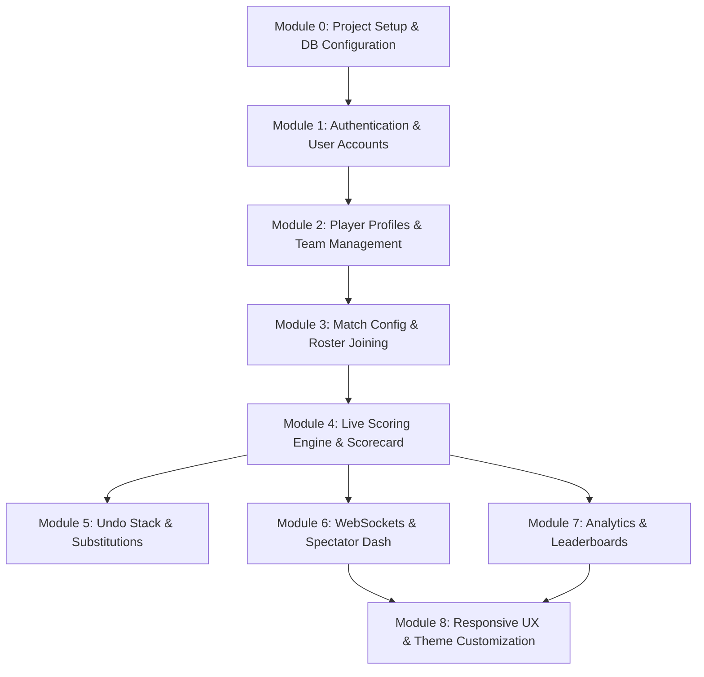

# BatNBall Implementation Modules

This document details the modular implementation plan for **BatNBall**, ordered sequentially by dependency. Each module outlines the objective, database updates, backend REST/WebSocket details, frontend user experience/screens, and verification steps to ensure a smooth development process.

---

## Dependency Matrix Overview



---

## Module 0: Project Setup & Core Databases Initialization

### 1. Objective
Establish the foundational directories, configuration systems, package dependency bundles, and initial database connections for the Node.js Express backend and Vite/React frontend.

### 2. Dependencies
- **None** (Foundational)

### 3. Backend Implementation (Node.js & Express)
- **Files to Create**:
  - `Backend/package.json`
  - `Backend/server.js` (Root entry point)
  - `Backend/config/db.js` (Mongoose connection file)
  - `Backend/config/supabase.js` (Supabase storage client initializer)
  - `Backend/.env` (Configuration secrets)
- **Dependencies to Install**: `express`, `mongoose`, `dotenv`, `cors`, `@supabase/supabase-js`, `morgan`
- **Database Connection Config**:
  - Connect to MongoDB via Mongoose:
    ```javascript
    const mongoose = require('mongoose');
    const connectDB = async () => {
      try {
        await mongoose.connect(process.env.MONGODB_URI);
        console.log("MongoDB Connected Successfully");
      } catch (err) {
        console.error("Database connection failure:", err.message);
        process.exit(1);
      }
    };
    ```
  - Initialize Supabase for file storage uploads using the public URL and service role key (to bypass RLS for image buckets).
- **Environment Variables Template (`.env`)**:
  ```env
  PORT=5000
  MONGODB_URI=mongodb://localhost:27017/batnball
  SUPABASE_URL=https://your-project-id.supabase.co
  SUPABASE_SERVICE_ROLE_KEY=your-supabase-service-role-key
  JWT_SECRET=your_jwt_secret_key
  ```

### 4. Frontend Implementation (React.js)
- **Files to Create**:
  - `Frontend/package.json` (Vite-based react-app boilerplate)
  - `Frontend/vite.config.js`
  - `Frontend/src/main.jsx`
  - `Frontend/src/App.jsx`
  - `Frontend/src/index.css` (Contains CSS variables for themes)
- **Dependencies to Install**: `react-router-dom`, `axios`, `lucide-react`, `socket.io-client`, `recharts`
- **Theme Variable Setup (`index.css`)**:
  ```css
  :root {
    /* Light Mode */
    --dominant-color: #FDFCF5; /* Cream/Off-white */
    --secondary-color: #1D4F2A; /* Classic Cricket Green */
    --accent-color: #C6A567; /* Soft Gold */
    --text-color: #1A1A1A; /* Near Black */
    --card-bg: rgba(255, 255, 255, 0.7);
    --border-color: rgba(29, 79, 42, 0.15);
  }

  [data-theme='dark'] {
    /* Dark Mode */
    --dominant-color: #1A1A1D; /* Dark Charcoal */
    --secondary-color: #4E4E50; /* Stone Grey */
    --accent-color: #C39797; /* Dusty Rose Gold */
    --text-color: #EAEAEA; /* Light Grey */
    --card-bg: rgba(30, 30, 35, 0.7);
    --border-color: rgba(195, 151, 151, 0.15);
  }
  ```

### 5. Verification & Testing
- **Backend**: Run `node server.js` and verify output indicates connection success to MongoDB.
- **Frontend**: Run `npm run dev` and open `http://localhost:5173` to verify Vite React app builds.

---

## Module 1: Authentication, Authorization & Roles Management

### 1. Objective
Build the secure sign-up, login, and authorization framework. Ensure that only Super Admins can register new users, while users can log in, change passwords, and perform self-service password recovery via mock SMS OTP.

### 2. Dependencies
- **Module 0** (Project Setup)

### 3. Database Schema Updates
- **User Collection (`users`)**:
  ```javascript
  const UserSchema = new mongoose.Schema({
    phone_number: { type: String, required: true, unique: true, index: true },
    password_hash: { type: String, required: true },
    role: { type: String, enum: ['SUPER_ADMIN', 'USER'], default: 'USER' },
    associated_player_id: { type: mongoose.Schema.Types.ObjectId, ref: 'Player', default: null },
    account_status: { type: String, enum: ['ACTIVE', 'SUSPENDED', 'DEACTIVATED'], default: 'ACTIVE' }
  }, { timestamps: true });
  ```

### 4. Backend Implementation
- **Middlewares**:
  - `authMiddleware.js`: Verifies JWT from request headers (`Authorization: Bearer <token>`).
  - `roleMiddleware.js`: Restricts routes to `SUPER_ADMIN`.
- **API Endpoints**:
  - `POST /api/v1/admin/users/create`
    - **Role**: `SUPER_ADMIN`
    - **Description**: Registers a user (phone & password). Automatically links a blank player profile.
  - `POST /api/v1/auth/login`
    - **Role**: Public
    - **Description**: Verifies password against hash. Generates JWT (includes user ID, role, and player ID). Checks if account is not suspended.
  - `PUT /api/v1/users/change-password`
    - **Role**: Authenticated (`SUPER_ADMIN` or `USER`)
    - **Description**: Validates old password and updates to new password.
  - `POST /api/v1/auth/forgot-password/request`
    - **Role**: Public
    - **Description**: Triggers a simulated 6-digit OTP stored in Redis/Memory for the given phone number.
  - `POST /api/v1/auth/forgot-password/verify`
    - **Role**: Public
    - **Description**: Validates the OTP and updates password.

### 5. Frontend Implementation
- **Files to Create**:
  - `src/context/AuthContext.jsx` (Keeps login status, JWT token, user roles, logs out user)
  - `src/pages/Login.jsx` (Form with custom shake micro-animation for invalid entries, glassmorphic layout)
  - `src/pages/ForgotPassword.jsx` (Handles requesting and entering the OTP)
- **Security Logic**:
  - Axios interceptor to append `Authorization: Bearer <token>` to headers.
  - Redirect rules checking if user profile is loaded.

### 6. Verification & Testing
- Use Postman to sign up a User account using a Super Admin token. Verify `403 Forbidden` if a standard User token tries it.
- Confirm that logging in returns a valid JWT, and that password change modifies the database record correctly.

---

## Module 2: Player Profiles & Team Management

### 1. Objective
Enable users to fill in their cricket styles and upload avatars. Support creating teams, uploading team logos, and managing squads. All files are uploaded to Supabase Storage.

### 2. Dependencies
- **Module 1** (Authentication & Users)

### 3. Database Schema Updates
- **Player Profile Collection (`players`)**:
  ```javascript
  const PlayerSchema = new mongoose.Schema({
    first_name: { type: String, required: true },
    last_name: { type: String, required: true },
    display_name: { type: String, required: true },
    profile_picture_url: { type: String, default: "" },
    date_of_birth: { type: Date },
    batting_style: { type: String, enum: ['RIGHT_HAND', 'LEFT_HAND'], required: true },
    bowling_style: { type: String, enum: [
      'RIGHT_ARM_FAST', 'RIGHT_ARM_MED', 'LEFT_ARM_FAST', 'LEFT_ARM_SPIN',
      'RIGHT_ARM_OFF_BREAK', 'RIGHT_ARM_LEG_BREAK', 'LEFT_ARM_UNORTHODOX', 'NONE'
    ], default: 'NONE' },
    player_roles: [{ type: String, enum: ['BATSMAN', 'BOWLER', 'ALL_ROUNDER', 'WICKET_KEEPER'] }]
  }, { timestamps: true });
  ```
- **Team Collection (`teams`)**:
  ```javascript
  const TeamSchema = new mongoose.Schema({
    team_name: { type: String, required: true, unique: true },
    team_short_name: { type: String, required: true },
    logo_url: { type: String, default: "" },
    created_by_user_id: { type: mongoose.Schema.Types.ObjectId, ref: 'User', required: true },
    squad_members: [{
      player_id: { type: mongoose.Schema.Types.ObjectId, ref: 'Player' },
      joined_date: { type: Date, default: Date.now },
      role_in_team: { type: String, enum: ['CAPTAIN', 'WICKET_KEEPER', 'MEMBER'], default: 'MEMBER' }
    }]
  }, { timestamps: true });
  ```

### 4. Backend Implementation
- **Supabase File Upload Integration**:
  - Middleware `multer` parses the image file.
  - Server uploads the file buffer to Supabase Storage bucket `avatars` or `logos` using `@supabase/supabase-js`. Returns the public CDN URL.
- **API Endpoints**:
  - `GET /api/v1/players/search?q=query`
    - **Description**: Returns list of matching players (searched by name/phone) to add to teams.
  - `PUT /api/v1/players/:playerId`
    - **Description**: Updates profile details (biography, styles, picture).
  - `POST /api/v1/teams`
    - **Description**: Creates a new team. Saves name, short name, uploads logo, and initializes squad.
  - `POST /api/v1/teams/:teamId/roster`
    - **Description**: Appends a selected player to `squad_members`.

### 5. Frontend Implementation
- **Files to Create**:
  - `src/pages/ProfileEdit.jsx` (Form to update user's player profile with drag-and-drop picture upload)
  - `src/pages/TeamCreate.jsx` (Form to name team, upload logo, search and dynamically add players to roster list)
- **UX Details**:
  - Render smooth slide-in transitions on roster lists when users are added or removed.

### 6. Verification & Testing
- Upload images from profile edit screen and verify they are viewable in the Supabase Storage web console.
- Query `GET /api/v1/players/search?q=...` and verify search filters by name.

---

## Module 3: Match Configuration, Roster Joining & Toss Setup

### 1. Objective
Establish the 3-phase match creation wizard: configuring metadata, managing live team joining rosters via shared links, and logging the coin toss decision.

### 2. Dependencies
- **Module 2** (Profiles & Teams)

### 3. Database Schema Updates
- **Match Collection (`matches`)**:
  ```javascript
  const MatchSchema = new mongoose.Schema({
    venue: { type: String, required: true },
    match_date_time: { type: Date, required: true },
    total_overs_per_innings: { type: Number, required: true },
    max_overs_per_bowler: { type: Number, required: true },
    ball_type: { type: String, enum: ['LEATHER_RED', 'LEATHER_WHITE', 'LEATHER_PINK', 'TENNIS', 'TAPE_TENNIS', 'COSCO'], required: true },
    match_status: { type: String, enum: ['UPCOMING', 'LIVE', 'PAUSED', 'RAIN_DELAY', 'COMPLETED', 'ABANDONED'], default: 'UPCOMING' },
    created_by: { type: mongoose.Schema.Types.ObjectId, ref: 'User', required: true },
    umpires: [{ type: mongoose.Schema.Types.ObjectId, ref: 'Player' }], // Max 4. Umpire[0] is match creator
    scorers: [{ type: mongoose.Schema.Types.ObjectId, ref: 'User' }],
    team_first_id: { type: mongoose.Schema.Types.ObjectId, ref: 'Team', required: true },
    team_second_id: { type: mongoose.Schema.Types.ObjectId, ref: 'Team', required: true },
    playing_xi_team_first: [{ type: mongoose.Schema.Types.ObjectId, ref: 'Player' }],
    playing_xi_team_second: [{ type: mongoose.Schema.Types.ObjectId, ref: 'Player' }],
    substitutes_team_first: [{ type: mongoose.Schema.Types.ObjectId, ref: 'Player' }],
    substitutes_team_second: [{ type: mongoose.Schema.Types.ObjectId, ref: 'Player' }],
    match_rules: {
      wide_ball_run_added: { type: Boolean, default: true },
      no_ball_run_calculated: { type: Boolean, default: true },
      no_ball_free_hit_enabled: { type: Boolean, default: true },
      overthrow_runs_allowed: { type: Boolean, default: true },
      bye_runs_allowed: { type: Boolean, default: true },
      leg_bye_runs_allowed: { type: Boolean, default: true },
      penalty_runs_allowed: { type: Boolean, default: true }
    },
    toss_won_by_team_id: { type: mongoose.Schema.Types.ObjectId, ref: 'Team', default: null },
    toss_decision: { type: String, enum: ['BAT', 'FIELD', null], default: null },
    winner_team_id: { type: mongoose.Schema.Types.ObjectId, ref: 'Team', default: null },
    result_type: { type: String, enum: ['RUNS', 'WICKETS', 'SUPER_OVER', 'TIE', 'NO_RESULT', 'DLS_METHOD', null], default: null },
    win_margin: { type: Number, default: 0 },
    player_of_the_match: { type: mongoose.Schema.Types.ObjectId, ref: 'Player', default: null }
  }, { timestamps: true });
  ```

### 4. Backend Implementation
- **API Endpoints**:
  - `POST /api/v1/matches`: Creates match config with status `UPCOMING`. Creator is added as first umpire.
  - `GET /api/v1/matches/:matchId/share-link`: Returns clipboard-ready invite link (`/matches/:matchId/join`).
  - `POST /api/v1/matches/:matchId/join`: Allows a spectator visiting the link to select team A or B and join the roster list. Emits WebSocket updates.
  - `PUT /api/v1/matches/:matchId/toss`: Logs toss details (winner and bat/field decision) and transitions match state to `LIVE`.

### 5. Frontend Implementation
- **Files to Create**:
  - `src/pages/CreateMatchWizard.jsx` (Multi-phase wizard)
- **Wizard Steps**:
  - **Phase 1: General Info**: Venue, date/time, total overs, bowler limits, rules checklist.
  - **Phase 2: Roster Setup**: Lists Teams. Shows **Share Link** button. Has an **Add Player** search modal for each team. Emits joining logs. As users click the shared URL and join, their names slide in.
  - **Phase 3: Toss Setup**: Dark theme overlay with dynamic coin-flip selector (Team A vs Team B) and choice of decision (Bat/Field).
- **UX Transitions**:
  - Clicks to "Start Match" transition with a visual fade-in to the Live Scoreboard.

### 6. Verification & Testing
- Create a match, copy the share link, and load it in an incognito window. Select Team B, type a mock player name, click "Join", and check if the creator's screen lists the player in real-time.
- Save toss results and check if match status changes to `LIVE` in MongoDB.

---

## Module 4: Live Scoring Engine & Scorecard Automation

### 1. Objective
Implement the core scoring engine. Process balls logged by the umpire, automate strike rotations, record runs/wickets/extras, and track batting/bowling partnerships.

### 2. Dependencies
- **Module 3** (Match Setup)

### 3. Database Schema Updates
- **Ball-by-Ball Collection (`ball_by_ball`)**:
  ```javascript
  const BallByBallSchema = new mongoose.Schema({
    match_id: { type: mongoose.Schema.Types.ObjectId, ref: 'Match', index: true },
    innings_number: { type: Number, required: true },
    over_number: { type: Number, required: true }, // 0 to N-1
    ball_number_in_over: { type: Number, required: true }, // 1 to 6
    total_legal_balls_in_innings: { type: Number, required: true },
    batting_team_id: { type: mongoose.Schema.Types.ObjectId, ref: 'Team' },
    bowling_team_id: { type: mongoose.Schema.Types.ObjectId, ref: 'Team' },
    striker_id: { type: mongoose.Schema.Types.ObjectId, ref: 'Player' },
    non_striker_id: { type: mongoose.Schema.Types.ObjectId, ref: 'Player' },
    bowler_id: { type: mongoose.Schema.Types.ObjectId, ref: 'Player' },
    runs_from_bat: { type: Number, min: 0, max: 6, default: 0 },
    is_boundary: { type: Boolean, default: false },
    boundary_type: { type: String, enum: ['FOUR', 'SIX', null], default: null },
    is_extra: { type: Boolean, default: false },
    extra_type: { type: String, enum: ['WIDE', 'NO_BALL', 'BYE', 'LEG_BYE', 'PENALTY', null], default: null },
    extra_runs: { type: Number, default: 0 },
    is_legal_delivery: { type: Boolean, default: true },
    is_dot_ball: { type: Boolean, default: true },
    is_control_shot: { type: Boolean, default: true },
    match_phase: { type: String, enum: ['POWERPLAY', 'MIDDLE_OVERS', 'DEATH_OVERS'] },
    dismissal: {
      is_wicket: { type: Boolean, default: false },
      dismissed_player_id: { type: mongoose.Schema.Types.ObjectId, ref: 'Player', default: null },
      wicket_type: { type: String, enum: [
        'BOWLED', 'CAUGHT', 'CAUGHT_AND_BOWLED', 'LBW', 'RUN_OUT',
        'STUMPED', 'HIT_WICKET', 'RETIRED_HURT', 'RETIRED_OUT', 'OBSTRUCTING_FIELD'
      ], default: null },
      fielder_involved_id: { type: mongoose.Schema.Types.ObjectId, ref: 'Player', default: null },
      is_direct_hit: { type: Boolean, default: false }
    },
    current_total_score: { type: Number, required: true },
    current_wickets_down: { type: Number, required: true },
    required_runs: { type: Number, default: null }
  });
  ```
- **Partnerships Collection (`partnerships`)**:
  ```javascript
  const PartnershipSchema = new mongoose.Schema({
    match_id: { type: mongoose.Schema.Types.ObjectId, ref: 'Match', index: true },
    batsman_1_id: { type: mongoose.Schema.Types.ObjectId, ref: 'Player' },
    batsman_2_id: { type: mongoose.Schema.Types.ObjectId, ref: 'Player' },
    total_runs_scored: { type: Number, default: 0 },
    total_balls_faced: { type: Number, default: 0 },
    runs_by_batsman_1: { type: Number, default: 0 },
    runs_by_batsman_2: { type: Number, default: 0 },
    balls_by_batsman_1: { type: Number, default: 0 },
    balls_by_batsman_2: { type: Number, default: 0 },
    extras_in_partnership: { type: Number, default: 0 },
    is_unbroken: { type: Boolean, default: true }
  });
  ```

### 4. Backend Implementation
- **Crease Initialization API (`POST /api/v1/matches/:matchId/score/initialize`)**:
  - Accept `striker_id`, `non_striker_id`, `bowler_id`. Save active state in current match.
- **Ball Logging API (`POST /api/v1/matches/:matchId/score/ball`)**:
  - **Inputs**: `runs_from_bat`, `is_boundary`, `boundary_type`, `is_extra`, `extra_type`, `extra_runs`, `is_wicket`, `dismissal_details`, `is_control_shot`.
  - **Business Rules**:
    - Calculate if ball is legal. (No-Balls and Wides are illegal. BYEs and LEG-BYEs are legal).
    - If legal, increment striker's balls faced and bowler's balls delivered.
    - Add runs to striker's runs (if run is off-the-bat) and bowler's runs conceded (unless it's BYE/LEG-BYE/PENALTY extra).
    - **Strike Rotation Logic**:
      - Swaps striker and non-striker positions if `runs_from_bat` is `1` or `3`.
      - Swaps striker and non-striker at the end of an over (when 6 legal balls are completed).
    - **Innings Transition**: If 10 wickets are down or overs are complete, mark Innings 1 closed. Trigger state for Innings 2.
    - Update/Create `Partnership` document for current batsman pair.

### 5. Frontend Implementation
- **Files to Create**:
  - `src/pages/ScoringBoard.jsx` (Scorecard control deck for Umpires)
- **Interactive Controls**:
  - Large button grid for easy click triggers (Runs: 0, 1, 2, 3, 4, 6; Action: Extra, Wicket).
  - Strike Indicator: Active striker has a green target/arrow icon. Swap transition uses smooth animation.
  - **Wicket Modal Dialog**: Prompt for wicket type (dropdown), fielder picker (only visible on catch/run out), and batsman retired/dismissed list. Shows selection grid for next batsman.
  - **Over Complete Popup**: Prompts for next bowler choice.

### 6. Verification & Testing
- Log a 1-run single: Verify team score updates, striker's runs update, and strike rotates.
- Log a Wide: Verify team score increments, bowler over count does *not* progress, striker balls faced does *not* progress.
- Log Wicket: Verify batsman is greyed out and replaced upon picking a new striker.

---

## Module 5: Rollback Control (Undo) & Mid-Over Substitutions

### 1. Objective
Allow scorers to fix mistakes. Enable up to 5 steps of stack-based undo rollbacks, and support substituting batsmen or bowlers mid-over (updating stats links retrospectively).

### 2. Dependencies
- **Module 4** (Scoring Engine)

### 3. Backend Implementation
- **Undo Operation (`POST /api/v1/matches/:matchId/score/undo`)**:
  - Keep a stack (stored in the database or fetched by sorting `ball_by_ball` by timestamp descending).
  - Pop the last ball logged from `ball_by_ball` collection.
  - Restore match score, wicket count, striker/non-striker positions, bowler balls/runs, and partnership totals to the pre-ball state.
  - Allow up to **5 actions** (5 balls) to be popped sequentially.
- **Substitution Operation (`POST /api/v1/matches/:matchId/score/substitute`)**:
  - Replace active player mid-over.
  - If a scorer corrects a player's entry (e.g. realizes the bowler was wrong after 3 balls), rewrite the `bowler_id` or `striker_id` fields for those 3 balls in the `ball_by_ball` collection and recalculate bowler/batsman counts.

### 4. Frontend Implementation
- **ScoringBoard Interface Elements**:
  - Floating **Undo** button (displays the number of remaining steps in brackets: e.g. "Undo (5)"). Disables when limit is reached.
  - Mid-over replacements: Click on the bowler's name or striker's name to open a substitution popup. Allows changing player and commits edit to backend.

### 5. Verification & Testing
- Log 3 balls (1 run, 4 runs, Wicket). Click "Undo" once: verify batsman returns to crease, wickets down decreases, and score reverts by 4. Click "Undo" again: verify score reverts by 1.
- Substitute bowler mid-over. Verify database reflects the change, assigning subsequent balls to the new bowler.

---

## Module 6: WebSockets & Spectator Live Tracking

### 1. Objective
Broadcast match updates instantly. Connect public viewers to live matches, and use real-time WebSockets to stream scorecard progress without page refreshes.

### 2. Dependencies
- **Module 4** (Live Scoring)

### 3. Backend WebSocket Implementation
- **Files to Create**:
  - `Backend/sockets/index.js` (Socket.io event registry)
- **Logic**:
  - Setup Socket.io on top of the Express HTTP server.
  - Join Room event: `join:match` (Adds client to channel `match_room_<match_id>`).
  - Score update emitter: On successful run-logging, undo, or substitution in Module 4/5, emit event `match:score_update` containing the latest match state, current partnership, bowler/batsman details, and live logs.

### 4. Frontend Spectator Implementation
- **Files to Create**:
  - `src/pages/VisitorDashboard.jsx` (Public read-only scoring sheet)
- **User Experience (UX)**:
  - Accessible without login via `/matches/:matchId/live`.
  - Subscribes to Socket.io client. When a score update event fires, trigger micro-animations:
    - Glowing text colors update.
    - Boundary event: Border flashes green.
    - Wicket event: Screen flashes red with a fade out.
  - Displays over summaries (e.g. `1 • 4 Wd 6 W`).
  - Interactive tabs to toggle between Live View and Full Scorecard.

### 5. Verification & Testing
- Open Umpire Board in Chrome and Visitor Dashboard in Firefox. Log score events in Chrome and verify the Firefox screen updates in real time.
- Verify that disconnecting and reconnecting visitor dashboard resumes socket feed cleanly.

---

## Module 7: Career Analytics, Stats Aggregation & Leaderboards

### 1. Objective
Derive career indicators (averages, strike rates, economy, performance splits) and build real-time leaderboards including Orange Cap, Purple Cap, and Chase Master lists.

### 2. Dependencies
- **Module 4** (Live Scoring)

### 3. Database Schema Updates
- **Player Career Stats Collection (`player_career_stats`)**:
  ```javascript
  const PlayerCareerStatsSchema = new mongoose.Schema({
    player_id: { type: mongoose.Schema.Types.ObjectId, ref: 'Player', unique: true, index: true },
    batting: {
      matches_played: { type: Number, default: 0 },
      innings_batted: { type: Number, default: 0 },
      not_outs: { type: Number, default: 0 },
      total_runs: { type: Number, default: 0 },
      highest_score: {
        runs: { type: Number, default: 0 },
        is_not_out: { type: Boolean, default: false }
      },
      balls_faced: { type: Number, default: 0 },
      centuries_100s: { type: Number, default: 0 },
      half_centuries_50s: { type: Number, default: 0 },
      ducks_total: { type: Number, default: 0 },
      golden_ducks: { type: Number, default: 0 },
      fours_count: { type: Number, default: 0 },
      sixes_count: { type: Number, default: 0 }
    },
    bowling: {
      innings_bowled: { type: Number, default: 0 },
      balls_bowled: { type: Number, default: 0 },
      maidens_overs: { type: Number, default: 0 },
      runs_conceded: { type: Number, default: 0 },
      wickets_taken: { type: Number, default: 0 },
      best_bowling_figures: {
        wickets: { type: Number, default: 0 },
        runs: { type: Number, default: 0 }
      },
      wides_conceded: { type: Number, default: 0 },
      no_balls_conceded: { type: Number, default: 0 },
      dot_balls_bowled_count: { type: Number, default: 0 }
    },
    fielding: {
      catches_total: { type: Number, default: 0 },
      stumpings: { type: Number, default: 0 },
      run_outs_assisted: { type: Number, default: 0 },
      run_outs_unassisted: { type: Number, default: 0 }
    }
  });
  ```

### 4. Backend Implementation
- **Aggregation Logic**:
  - Create a service class to update `player_career_stats` upon match completion. It queries all `ball_by_ball` records containing the `player_id` (either as striker, bowler, or fielder) and computes aggregated records.
- **API Endpoints**:
  - `GET /api/v1/leaderboard/caps`: Returns top 5 batters (Orange Cap) and top 5 bowlers (Purple Cap).
  - `GET /api/v1/leaderboard/chase-masters`: Computes top 5 batsmen in 2nd innings run-chases, sorted by cumulative chase runs weighted by team win percentage.
  - `GET /api/v1/players/:playerId/stats/charts`: Returns matching logs formatted for Recharts.

### 5. Frontend Implementation
- **Files to Create**:
  - `src/pages/Leaderboard.jsx` (Cap decks display with special gold, orange, and purple accent gradients)
  - `src/components/StatsRadarChart.jsx` (Radar comparison vs pacers/spinners)
  - `src/components/RunsTimelineChart.jsx` (Line chart tracking player form)

### 6. Verification & Testing
- Seed matches with run logs. Query `GET /api/v1/leaderboard/caps` and verify results return the correct top 5 players sorted by runs and wickets.
- Verify batting average handles division-by-zero (returns `-` if player has never been dismissed).

---

## Module 8: Responsive Layout, Themes, & Mobile-First CSS

### 1. Objective
Refine user interface aesthetics. Apply the core Light Mode (Cream/Cricket Green/Soft Gold) and Dark Mode (Charcoal/Stone/Dusty Rose Gold) styles. Optimize layouts for mobile devices where 99% of user activity occurs.

### 2. Dependencies
- **Modules 1-7** (Feature Complete)

### 3. Styling Configuration
- Ensure all layouts use CSS variables rather than hardcoded colors.
- **Responsive Guidelines**:
  - Wrap scorecard columns in flex layouts that stack on screens narrower than `768px`.
  - Use large, tap-friendly buttons (minimum height `48px`) on scoring grids to accommodate mobile thumb clicks.

### 4. Frontend Theme Selector
- **Files to Create**:
  - `src/components/ThemeToggle.jsx` (Floating switcher updating `document.documentElement.setAttribute('data-theme', theme)`)
- Add glassmorphic headers and clean backdrops with subtle border glow animations to make the UI look premium.

### 5. Verification & Testing
- Toggle Light/Dark mode and verify that text contrast and visual clarity remain high.
- Load page in Google Chrome DevTools Device Mode (using iPhone SE and Pixel 7 viewports) to check that no scoring buttons overflow the screen.
