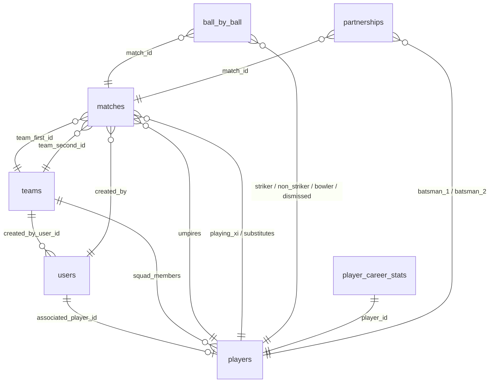

# BatNBall MongoDB Schema & Architectural Details

This document outlines the complete MongoDB database design, Mongoose schema blueprints, field-level constraints, indexing strategies, and relationships for the **BatNBall** sports tracking platform.

---

## 1. Schema Relationships Diagram



---

## 2. Global Indexing Strategy

To maintain sub-second retrieval speeds for live scoring and analytics widgets, the following indexes must be configured:

| Collection | Indexed Field(s) | Type | Purpose |
| :--- | :--- | :--- | :--- |
| `users` | `phone_number` | Single / Unique | Fast login and verification |
| `players` | `display_name` | Text Index | Search player lists |
| `teams` | `team_name` | Single / Unique | Prevent duplicate registrations |
| `matches` | `match_status` | Single | Filter upcoming vs live matches |
| `matches` | `created_by` | Single | Fetch user's managed matches |
| `ball_by_ball` | `match_id` | Single | Retrieve full live match event log |
| `ball_by_ball` | `match_id`, `innings_number` | Compound | Fetch scoreboard for specific innings |
| `player_career_stats` | `player_id` | Single / Unique | Render player profile page analytics |
| `partnerships` | `match_id` | Single | Load partnership stats for a live match |

---

## 3. Collections Reference Spec

### 3.1. Users Collection (`users`)
Stores authorization credentials, security states, and access role tiers.

#### Schema Properties:
- **`user_id`**: `ObjectId` (Mongoose auto-generated primary key)
- **`phone_number`**: `String` 
  - *Validation*: E.164 compliance (regex matching `^\+[1-9]\d{1,14}$`), must be unique.
- **`password_hash`**: `String` (Bcrypt-hashed password string)
- **`role`**: `String`
  - *Options*: `SUPER_ADMIN`, `USER`
  - *Default*: `USER`
- **`associated_player_id`**: `ObjectId` (References `players` collection, optional / null if profile is not updated yet)
- **`account_status`**: `String`
  - *Options*: `ACTIVE`, `SUSPENDED`, `DEACTIVATED`
  - *Default*: `ACTIVE`

#### Sample JSON Document:
```json
{
  "_id": "603d2110c79e6022e0385921",
  "phone_number": "+919876543210",
  "password_hash": "$2b$10$EPf654s8d9fsd78fds98fsd.df98sf98sd98fsd98fsd98fsd98fs",
  "role": "USER",
  "associated_player_id": "603d2134c79e6022e0385922",
  "account_status": "ACTIVE",
  "createdAt": "2026-07-15T18:00:00.000Z",
  "updatedAt": "2026-07-15T18:00:00.000Z"
}
```

---

### 3.2. Player Profile Collection (`players`)
Contains bio details, play styles, and links to squads.

#### Schema Properties:
- **`first_name`**: `String` (Required, trim trailing whitespace)
- **`last_name`**: `String` (Required, trim trailing whitespace)
- **`display_name`**: `String` (Used on scoreboard displays, e.g. "V. Kohli")
- **`profile_picture_url`**: `String` (Supabase CDN image link)
- **`date_of_birth`**: `Date` (Used to calculate player age splits)
- **`batting_style`**: `String`
  - *Options*: `RIGHT_HAND`, `LEFT_HAND`
- **`bowling_style`**: `String`
  - *Options*: `RIGHT_ARM_FAST`, `RIGHT_ARM_MED`, `LEFT_ARM_FAST`, `LEFT_ARM_SPIN`, `RIGHT_ARM_OFF_BREAK`, `RIGHT_ARM_LEG_BREAK`, `LEFT_ARM_UNORTHODOX`, `NONE`
  - *Default*: `NONE`
- **`player_roles`**: `Array` of strings
  - *Allowed Items*: `BATSMAN`, `BOWLER`, `ALL_ROUNDER`, `WICKET_KEEPER`

#### Sample JSON Document:
```json
{
  "_id": "603d2134c79e6022e0385922",
  "first_name": "Virat",
  "last_name": "Kohli",
  "display_name": "V. Kohli",
  "profile_picture_url": "https://placeholder.supabase.co/storage/v1/object/public/avatars/vkohli.png",
  "date_of_birth": "1988-11-05T00:00:00.000Z",
  "batting_style": "RIGHT_HAND",
  "bowling_style": "RIGHT_ARM_MED",
  "player_roles": ["BATSMAN", "ALL_ROUNDER"],
  "createdAt": "2026-07-15T18:05:00.000Z",
  "updatedAt": "2026-07-15T18:05:00.000Z"
}
```

---

### 3.3. Team Collection (`teams`)
Groups players into squads.

#### Schema Properties:
- **`team_name`**: `String` (Required, unique)
- **`team_short_name`**: `String` (Required, e.g. "RCB", uppercase validation)
- **`logo_url`**: `String` (Supabase CDN image link)
- **`created_by_user_id`**: `ObjectId` (References `users` collection)
- **`squad_members`**: `Array` of sub-documents:
  - `player_id`: `ObjectId` (References `players` collection)
  - `joined_date`: `Date` (Defaults to `Date.now`)
  - `role_in_team`: `String` (Options: `CAPTAIN`, `WICKET_KEEPER`, `MEMBER`, default is `MEMBER`)

#### Sample JSON Document:
```json
{
  "_id": "603d215ac79e6022e0385923",
  "team_name": "Royal Challengers Bengaluru",
  "team_short_name": "RCB",
  "logo_url": "https://placeholder.supabase.co/storage/v1/object/public/logos/rcb.png",
  "created_by_user_id": "603d2110c79e6022e0385921",
  "squad_members": [
    {
      "player_id": "603d2134c79e6022e0385922",
      "joined_date": "2026-07-15T18:10:00.000Z",
      "role_in_team": "CAPTAIN"
    }
  ],
  "createdAt": "2026-07-15T18:10:00.000Z",
  "updatedAt": "2026-07-15T18:10:00.000Z"
}
```

---

### 3.4. Match Metadata & Configuration Collection (`matches`)
Contains venues, playing rules, lineups, and match outcomes.

#### Schema Properties:
- **`venue`**: `String` (Ground/Stadium)
- **`match_date_time`**: `Date`
- **`total_overs_per_innings`**: `Number` (Typically 20 or 50)
- **`max_overs_per_bowler`**: `Number`
- **`ball_type`**: `String` (Options: `LEATHER_RED`, `LEATHER_WHITE`, `LEATHER_PINK`, `TENNIS`, `TAPE_TENNIS`, `COSCO`)
- **`match_status`**: `String` (Options: `UPCOMING`, `LIVE`, `PAUSED`, `RAIN_DELAY`, `COMPLETED`, `ABANDONED`)
- **`created_by`**: `ObjectId` (References `users`)
- **`umpires`**: `Array` of `ObjectId` (References `players`, maximum limit of 4)
- **`scorers`**: `Array` of `ObjectId` (References `users`)
- **`team_first_id`**: `ObjectId` (References `teams`)
- **`team_second_id`**: `ObjectId` (References `teams`)
- **`playing_xi_team_first`**: `Array` of `ObjectId` (References `players`)
- **`playing_xi_team_second`**: `Array` of `ObjectId` (References `players`)
- **`substitutes_team_first`**: `Array` of `ObjectId` (References `players`)
- **`substitutes_team_second`**: `Array` of `ObjectId` (References `players`)
- **`match_rules`**: Sub-document:
  - `wide_ball_run_added`: `Boolean` (default: `true`)
  - `no_ball_run_calculated`: `Boolean` (default: `true`)
  - `no_ball_free_hit_enabled`: `Boolean` (default: `true`)
  - `overthrow_runs_allowed`: `Boolean` (default: `true`)
  - `bye_runs_allowed`: `Boolean` (default: `true`)
  - `leg_bye_runs_allowed`: `Boolean` (default: `true`)
  - `penalty_runs_allowed`: `Boolean` (default: `true`)
- **`toss_won_by_team_id`**: `ObjectId` (References `teams`)
- **`toss_decision`**: `String` (Options: `BAT`, `FIELD`)
- **`winner_team_id`**: `ObjectId` (References `teams`, null if tie/no result)
- **`result_type`**: `String` (Options: `RUNS`, `WICKETS`, `SUPER_OVER`, `TIE`, `NO_RESULT`, `DLS_METHOD`)
- **`win_margin`**: `Number` (e.g. 5 for Wickets, 12 for Runs)
- **`player_of_the_match`**: `ObjectId` (References `players`)

#### Sample JSON Document:
```json
{
  "_id": "603d2180c79e6022e0385924",
  "venue": "M. Chinnaswamy Stadium, Bengaluru",
  "match_date_time": "2026-07-16T19:00:00.000Z",
  "total_overs_per_innings": 20,
  "max_overs_per_bowler": 4,
  "ball_type": "LEATHER_WHITE",
  "match_status": "LIVE",
  "created_by": "603d2110c79e6022e0385921",
  "umpires": ["603d2134c79e6022e0385922"],
  "scorers": ["603d2110c79e6022e0385921"],
  "team_first_id": "603d215ac79e6022e0385923",
  "team_second_id": "603d2200c79e6022e0385925",
  "playing_xi_team_first": ["603d2134c79e6022e0385922"],
  "playing_xi_team_second": ["603d2210c79e6022e0385926"],
  "substitutes_team_first": [],
  "substitutes_team_second": [],
  "match_rules": {
    "wide_ball_run_added": true,
    "no_ball_run_calculated": true,
    "no_ball_free_hit_enabled": true,
    "overthrow_runs_allowed": true,
    "bye_runs_allowed": true,
    "leg_bye_runs_allowed": true,
    "penalty_runs_allowed": true
  },
  "toss_won_by_team_id": "603d215ac79e6022e0385923",
  "toss_decision": "BAT",
  "winner_team_id": null,
  "result_type": null,
  "win_margin": 0,
  "player_of_the_match": null,
  "createdAt": "2026-07-15T18:20:00.000Z",
  "updatedAt": "2026-07-15T18:20:00.000Z"
}
```

---

### 3.5. Ball-by-Ball Logging Collection (`ball_by_ball`)
Logs every ball events sequentially.

#### Schema Properties:
- **`match_id`**: `ObjectId` (References `matches`)
- **`innings_number`**: `Number` (1, 2, 3, or 4)
- **`over_number`**: `Number` (Integer, 0 to N-1)
- **`ball_number_in_over`**: `Number` (Legal deliveries counter: 1 to 6)
- **`total_legal_balls_in_innings`**: `Number` (Cumulative counter)
- **`batting_team_id`**: `ObjectId` (References `teams`)
- **`bowling_team_id`**: `ObjectId` (References `teams`)
- **`striker_id`**: `ObjectId` (References `players`)
- **`non_striker_id`**: `ObjectId` (References `players`)
- **`bowler_id`**: `ObjectId` (References `players`)
- **`runs_from_bat`**: `Number` (0 to 6)
- **`is_boundary`**: `Boolean`
- **`boundary_type`**: `String` (Options: `FOUR`, `SIX`, null)
- **`is_extra`**: `Boolean`
- **`extra_type`**: `String` (Options: `WIDE`, `NO_BALL`, `BYE`, `LEG_BYE`, `PENALTY`, null)
- **`extra_runs`**: `Number`
- **`is_legal_delivery`**: `Boolean`
- **`is_dot_ball`**: `Boolean`
- **`is_control_shot`**: `Boolean` (Umpire log)
- **`match_phase`**: `String` (Options: `POWERPLAY`, `MIDDLE_OVERS`, `DEATH_OVERS`)
- **`dismissal`**: Sub-document:
  - `is_wicket`: `Boolean` (default: `false`)
  - `dismissed_player_id`: `ObjectId` (References `players`)
  - `wicket_type`: `String` (Options: `BOWLED`, `CAUGHT`, `CAUGHT_AND_BOWLED`, `LBW`, `RUN_OUT`, `STUMPED`, `HIT_WICKET`, `RETIRED_HURT`, `RETIRED_OUT`, `OBSTRUCTING_FIELD`)
  - `fielder_involved_id`: `ObjectId` (References `players`, optional / null)
  - `is_direct_hit`: `Boolean`
- **`current_total_score`**: `Number` (Running total)
- **`current_wickets_down`**: `Number` (Running total)
- **`required_runs`**: `Number` (Runs remaining for chase in 2nd innings)

#### Sample JSON Document:
```json
{
  "_id": "603d2310c79e6022e0385930",
  "match_id": "603d2180c79e6022e0385924",
  "innings_number": 1,
  "over_number": 0,
  "ball_number_in_over": 1,
  "total_legal_balls_in_innings": 1,
  "batting_team_id": "603d215ac79e6022e0385923",
  "bowling_team_id": "603d2200c79e6022e0385925",
  "striker_id": "603d2134c79e6022e0385922",
  "non_striker_id": "603d2210c79e6022e0385926",
  "bowler_id": "603d2300c79e6022e0385929",
  "runs_from_bat": 4,
  "is_boundary": true,
  "boundary_type": "FOUR",
  "is_extra": false,
  "extra_type": null,
  "extra_runs": 0,
  "is_legal_delivery": true,
  "is_dot_ball": false,
  "is_control_shot": true,
  "match_phase": "POWERPLAY",
  "dismissal": {
    "is_wicket": false,
    "dismissed_player_id": null,
    "wicket_type": null,
    "fielder_involved_id": null,
    "is_direct_hit": false
  },
  "current_total_score": 4,
  "current_wickets_down": 0,
  "required_runs": null
}
```

---

### 3.6. Professional Career Statistics Collection (`player_career_stats`)
Aggregated results updated at the end of each match.

#### Schema Properties:
- **`player_id`**: `ObjectId` (References `players`, unique index)
- **`batting`**: Sub-document:
  - `matches_played`, `innings_batted`, `not_outs`, `total_runs`
  - `highest_score`: Sub-document containing `runs` (number) and `is_not_out` (boolean)
  - `balls_faced`, `centuries_100s`, `half_centuries_50s`, `ducks_total`, `golden_ducks`, `fours_count`, `sixes_count`
- **`bowling`**: Sub-document:
  - `innings_bowled`, `balls_bowled`, `maidens_overs`, `runs_conceded`, `wickets_taken`
  - `best_bowling_figures`: Sub-document containing `wickets` and `runs`
  - `wides_conceded`, `no_balls_conceded`, `dot_balls_bowled_count`
- **`fielding`**: Sub-document:
  - `catches_total`, `stumpings`, `run_outs_assisted`, `run_outs_unassisted`

#### Sample JSON Document:
```json
{
  "_id": "603d2450c79e6022e0385940",
  "player_id": "603d2134c79e6022e0385922",
  "batting": {
    "matches_played": 150,
    "innings_batted": 145,
    "not_outs": 20,
    "total_runs": 7240,
    "highest_score": {
      "runs": 183,
      "is_not_out": true
    },
    "balls_faced": 5300,
    "centuries_100s": 25,
    "half_centuries_50s": 38,
    "ducks_total": 4,
    "golden_ducks": 1,
    "fours_count": 680,
    "sixes_count": 120
  },
  "bowling": {
    "innings_bowled": 32,
    "balls_bowled": 480,
    "maidens_overs": 2,
    "runs_conceded": 540,
    "wickets_taken": 12,
    "best_bowling_figures": {
      "wickets": 3,
      "runs": 28
    },
    "wides_conceded": 15,
    "no_balls_conceded": 3,
    "dot_balls_bowled_count": 190
  },
  "fielding": {
    "catches_total": 84,
    "stumpings": 0,
    "run_outs_assisted": 18,
    "run_outs_unassisted": 9
  }
}
```

---

### 3.7. Partnerships Records Collection (`partnerships`)
Aggregates partnership records.

#### Schema Properties:
- **`match_id`**: `ObjectId` (References `matches`)
- **`batsman_1_id`**: `ObjectId` (References `players`)
- **`batsman_2_id`**: `ObjectId` (References `players`)
- **`total_runs_scored`**: `Number`
- **`total_balls_faced`**: `Number`
- **`runs_by_batsman_1`**: `Number`
- **`runs_by_batsman_2`**: `Number`
- **`balls_by_batsman_1`**: `Number`
- **`balls_by_batsman_2`**: `Number`
- **`extras_in_partnership`**: `Number`
- **`is_unbroken`**: `Boolean` (True if crease was not broken at innings closure)

#### Sample JSON Document:
```json
{
  "_id": "603d2500c79e6022e0385950",
  "match_id": "603d2180c79e6022e0385924",
  "batsman_1_id": "603d2134c79e6022e0385922",
  "batsman_2_id": "603d2210c79e6022e0385926",
  "total_runs_scored": 124,
  "total_balls_faced": 78,
  "runs_by_batsman_1": 72,
  "runs_by_batsman_2": 48,
  "balls_by_batsman_1": 42,
  "balls_by_batsman_2": 36,
  "extras_in_partnership": 4,
  "is_unbroken": true
}
```
