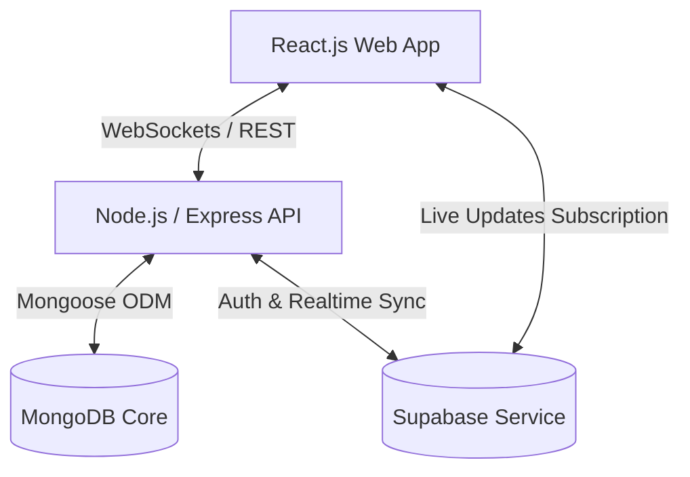

# BatNBall System Architecture & Detailed Documentation

This document provides a comprehensive system architecture, database design, and business rules specification for the **BatNBall** Cricket tracking platform.

---

## 1. System Overview & Objectives
**BatNBall** is an elite sports analytics and live cricket tracking platform. It allows users to schedule, manage, and log cricket matches ball-by-ball, dynamically calculating advanced player statistics, team standings, and historic trends in real time. 

Initially, the application is designed and built as a **Full-Stack Web Application** with real-time updates. The backend and database architecture are designed with app-ready API contracts to facilitate a seamless extension to a **Mobile App (React Native)** in future phases.

### Core Objectives
- **Zero-Lag Real-Time Updates**: Ensure score updates are instantly broadcasted to all viewers using WebSockets.
- **High-Granularity Ball-by-Ball Logging**: Log every event (runs, wickets, extras, shots) to derive advanced metrics dynamically.
- **Frictionless Scoring UI**: Enable umpires to log matches with minimal clicks, automatically handling strike rotations, over boundaries, and state changes.
- **Comprehensive Analytics**: Generate career stats, visual player progression graphs, and special metrics (like IPL Orange/Purple Cap, Chase Master).

---

## 2. Technology Stack

- **Frontend**: **React.js** (built with modern hooks, state management, and optimized rendering to support high-frequency updates during live matches).
- **Backend**: **Node.js** with Express, providing a clean RESTful API and WebSocket gateways.
- **Core Database**: **MongoDB** (to store unstructured/nested statistical splits, ball-by-ball logs, and profiles).
- **Authentication & Real-Time Sync**: **Supabase** (used for user authentication/session management and Postgres-backed real-time messaging/DB replication where applicable, alongside MongoDB for the core relational/document store).
- **Mobile (Future Phase)**: **React Native** (sharing Backend APIs and schema patterns).

---

## 3. Database Schema Blueprint
The system uses MongoDB as its primary store due to the highly nested, document-oriented nature of sports splits and career matrices.

### 3.1. Users Collection (`users`)
Stores core application access credentials, security states, and privilege tiers.
- `user_id`: `ObjectId` (Primary Key)
- `phone_number`: `String` (Unique Index, format: E.164, e.g., `+919876543210`)
- `password_hash`: `String` (Bcrypt hash)
- `role`: `Enum` (`SUPER_ADMIN`, `USER`)
- `associated_player_id`: `ObjectId` (References `players.player_id` | `null` if user has not linked or created their player profile)
- `account_status`: `Enum` (`ACTIVE`, `SUSPENDED`, `DEACTIVATED`)
- `created_at`: `Timestamp`
- `updated_at`: `Timestamp`

### 3.2. Player Profile Collection (`players`)
Contains biographical details, specialized sporting roles, and physical attributes.
- `player_id`: `ObjectId` (Primary Key)
- `first_name`: `String`
- `last_name`: `String`
- `display_name`: `String` (e.g., `S. Tendulkar`, `V. Kohli`)
- `profile_picture_url`: `String`
- `date_of_birth`: `Date`
- `batting_style`: `Enum` (`RIGHT_HAND`, `LEFT_HAND`)
- `bowling_style`: `Enum` (
  `RIGHT_ARM_FAST`,
  `RIGHT_ARM_MED`,
  `LEFT_ARM_FAST`,
  `LEFT_ARM_SPIN`,
  `RIGHT_ARM_OFF_BREAK`,
  `RIGHT_ARM_LEG_BREAK`,
  `LEFT_ARM_UNORTHODOX`
)
- `player_roles`: `Array` of `Enum` (`BATSMAN`, `BOWLER`, `ALL_ROUNDER`, `WICKET_KEEPER`)
- `current_teams`: `Array` of `ObjectId` (References `teams.team_id`)
- `created_at`: `Timestamp`
- `updated_at`: `Timestamp`

### 3.3. Team Collection (`teams`)
Groups player profiles into structural units and catalogs collective squad metadata.
- `team_id`: `ObjectId` (Primary Key)
- `team_name`: `String` (Unique)
- `team_short_name`: `String` (e.g., `RCB`, `MI`, `CSK`)
- `created_by_user_id`: `ObjectId` (References `users.user_id`)
- `logo_url`: `String`
- `squad_members`: `Array` of Sub-objects:
  - `player_id`: `ObjectId` (References `players.player_id`)
  - `joined_date`: `Date`
  - `role_in_team`: `Enum` (`CAPTAIN`, `WICKET_KEEPER`, `MEMBER`)
- `created_at`: `Timestamp`
- `updated_at`: `Timestamp`

### 3.4. Match Metadata & Configuration Collection (`matches`)
Configures playing environments, live structural rules, and dynamic global match results.
- `match_id`: `ObjectId` (Primary Key)
- `tournament_id`: `ObjectId` (References `tournaments.tournament_id` | `null` for friendly matches)
- `venue`: `String` (Ground/Stadium name)
- `match_date_time`: `DateTime`
- `total_overs_per_innings`: `Integer` (e.g., `20`, `50`)
- `max_overs_per_bowler`: `Integer` (e.g., `4` for T20, `10` for ODI)
- `ball_type`: `Enum` (`LEATHER_RED`, `LEATHER_WHITE`, `LEATHER_PINK`, `TENNIS`, `TAPE_TENNIS`, `COSCO`)
- `match_status`: `Enum` (`UPCOMING`, `LIVE`, `PAUSED`, `RAIN_DELAY`, `COMPLETED`, `ABANDONED`)
- `created_by`: `ObjectId` (References `users.user_id` - Creator is default umpire #1)
- `umpires`: `Array` of `ObjectId` (References `players.player_id`, maximum `4` umpires. Only umpires have score edit privileges)
- `scorers`: `Array` of `ObjectId` (References `users.user_id`, assistants authorized to edit score sheets)
- `team_first_id`: `ObjectId` (References `teams.team_id`)
- `team_second_id`: `ObjectId` (References `teams.team_id`)
- `playing_xi_team_first`: `Array` of `ObjectId` (References `players.player_id`, exactly 11 players)
- `playing_xi_team_second`: `Array` of `ObjectId` (References `players.player_id`, exactly 11 players)
- `substitutes_team_first`: `Array` of `ObjectId` (References `players.player_id`)
- `substitutes_team_second`: `Array` of `ObjectId` (References `players.player_id`)

#### Match Rules Configuration (`match_rules` Sub-object)
- `wide_ball_run_added`: `Boolean` (Whether a wide ball awards 1 run to the batting team)
- `no_ball_run_calculated`: `Boolean` (Whether a no-ball awards 1 run to the batting team)
- `no_ball_free_hit_enabled`: `Boolean` (Whether the ball following a no-ball is a Free Hit)
- `overthrow_runs_allowed`: `Boolean` (Whether runs resulting from fielders throwing past the wickets are counted)
- `bye_runs_allowed`: `Boolean` (Whether runs scored when batsman misses ball and keeper misses it are counted)
- `leg_bye_runs_allowed`: `Boolean` (Whether runs scored off the batsman's body are counted)
- `penalty_runs_allowed`: `Boolean` (Whether penalty runs can be awarded, e.g., ball hitting keeper's helmet on ground)

#### Toss Details
- `toss_won_by_team_id`: `ObjectId` (References `teams.team_id`)
- `toss_decision`: `Enum` (`BAT`, `FIELD`)

#### Result Matrix
- `winner_team_id`: `ObjectId` (References `teams.team_id` | `null` for tie/no-result)
- `result_type`: `Enum` (`RUNS`, `WICKETS`, `SUPER_OVER`, `TIE`, `NO_RESULT`, `DLS_METHOD`)
- `win_margin`: `Integer` (Runs or wickets margin)
- `player_of_the_match`: `ObjectId` (References `players.player_id`)

---

### 3.5. Ball-by-Ball Logging Collection (`ball_by_ball`)
The atomic log engine of the database. Every professional metric, graph, and historical report is derived from this dataset.
- `ball_id`: `ObjectId` (Primary Key)
- `match_id`: `ObjectId` (References `matches.match_id`, indexed)
- `innings_number`: `Integer` (`1`, `2`, `3`, `4`)
- `over_number`: `Integer` (Current over index, e.g., `0` for 1st over, `19` for 20th over)
- `ball_number_in_over`: `Integer` (Legal deliveries counter: `1` to `6`)
- `total_legal_balls_in_innings`: `Integer` (Sequential tracker of legal deliveries in the innings)
- `batting_team_id`: `ObjectId` (References `teams.team_id`)
- `bowling_team_id`: `ObjectId` (References `teams.team_id`)
- `striker_id`: `ObjectId` (References `players.player_id`)
- `non_striker_id`: `ObjectId` (References `players.player_id`)
- `bowler_id`: `ObjectId` (References `players.player_id`)

#### Runs Accounting
- `runs_from_bat`: `Integer` (`0` to `6`)
- `is_boundary`: `Boolean`
- `boundary_type`: `Enum` (`FOUR`, `SIX` | `null`)

#### Extras Accounting
- `is_extra`: `Boolean`
- `extra_type`: `Enum` (`WIDE`, `NO_BALL`, `BYE`, `LEG_BYE`, `PENALTY` | `null`)
- `extra_runs`: `Integer` (Runs awarded from the extra type)

#### Advanced Analytics Data
- `is_legal_delivery`: `Boolean` (Calculated based on match rules & delivery type. e.g., `false` if `NO_BALL` or `WIDE`)
- `is_dot_ball`: `Boolean` (True if legal delivery and 0 runs scored off bat and no extras that run-count)
- `is_control_shot`: `Boolean` (Subjective assessment logged by umpire: did batsman middle the ball or play in control?)
- `match_phase`: `Enum` (`POWERPLAY`, `MIDDLE_OVERS`, `DEATH_OVERS`)

#### Dismissal Sub-object (`dismissal` | `null`)
- `is_wicket`: `Boolean`
- `dismissed_player_id`: `ObjectId` (References `players.player_id`)
- `wicket_type`: `Enum` (`BOWLED`, `CAUGHT`, `CAUGHT_AND_BOWLED`, `LBW`, `RUN_OUT`, `STUMPED`, `HIT_WICKET`, `RETIRED_HURT`, `RETIRED_OUT`, `OBSTRUCTING_FIELD`)
- `fielder_involved_id`: `ObjectId` (References `players.player_id` | `null`)
- `is_direct_hit`: `Boolean` (Only relevant for `RUN_OUT`)

#### Instantaneous State Tracking (Snapshot after this delivery)
- `current_total_score`: `Integer`
- `current_wickets_down`: `Integer`
- `required_runs`: `Integer` (Only relevant during the 2nd innings run-chase)

---

### 3.6. Professional Career Statistics Collection (`player_career_stats`)
Aggregated metrics structured directly for charts, profile visual modules, and career historical trends.

#### Batting Statistics Matrix
- `player_id`: `ObjectId` (References `players.player_id`, Unique Index)
- `matches_played`: `Integer`
- `innings_batted`: `Integer`
- `not_outs`: `Integer`
- `total_runs`: `Integer`
- `highest_score`: Sub-object:
  - `runs`: `Integer`
  - `is_not_out`: `Boolean`
- `batting_average`: `Float`
- `balls_faced`: `Integer`
- `batting_strike_rate`: `Float`
- `centuries_100s`: `Integer`
- `half_centuries_50s`: `Integer`
- `fifties_to_hundreds_conversion_rate`: `Float`
- `ducks_total`: `Integer`
- `golden_ducks`: `Integer` (Out first ball)
- `fours_count`: `Integer`
- `sixes_count`: `Integer`
- `boundary_runs_percentage`: `Float` (Percentage of runs scored via boundaries)
- `dot_ball_percentage_faced`: `Float`
- `control_shot_percentage`: `Float`
- **Batting Splits**:
  - `vs_bowling_type_split`: Arrays mapping performance metrics against left-arm/right-arm spinners and pacers.
  - `by_match_phase_split`: Performance curves for Powerplay, Middle, and Death phases.
  - `by_batting_position_split`: Stats structured by batting position (#1 through #11).

#### Bowling Statistics Matrix
- `innings_bowled`: `Integer`
- `balls_bowled`: `Integer`
- `overs_bowled_calculated`: `Float` (Overs format, e.g., 24.3, where .3 represents 3 legal balls)
- `maidens_overs`: `Integer`
- `runs_conceded`: `Integer`
- `wickets_taken`: `Integer`
- `best_bowling_figures`: Sub-object:
  - `wickets`: `Integer`
  - `runs`: `Integer`
- `bowling_average`: `Float`
- `economy_rate`: `Float`
- `bowling_strike_rate`: `Float`
- `three_wicket_hauls`: `Integer`
- `five_wicket_hauls`: `Integer`
- `wides_conceded`: `Integer`
- `no_balls_conceded`: `Integer`
- `dot_balls_bowled_count`: `Integer`
- `dot_ball_percentage_bowled`: `Float`
- `fours_conceded`: `Integer`
- `sixes_conceded`: `Integer`
- **Bowling Splits**:
  - `vs_batsman_hand_split`: Bowler's statistics against Left-Hand vs Right-Hand batters.
  - `by_match_phase_split`: Economy and strike rate dynamics in Powerplay vs Death overs.

#### Fielding & Wicket-Keeping Matrix
- `catches_total`: `Integer`
- `catches_as_fielder`: `Integer`
- `catches_as_keeper`: `Integer`
- `stumpings`: `Integer`
- `run_outs_assisted`: `Integer` (Thrower or relay fielder)
- `run_outs_unassisted`: `Integer` (Direct hit runner-out)

---

### 3.7. Partnerships Records Collection (`partnerships`)
Logs cumulative statistical data compiled by batting combinations across matches.
- `partnership_id`: `ObjectId` (Primary Key)
- `match_id`: `ObjectId` (References `matches.match_id`)
- `batsman_1_id`: `ObjectId` (References `players.player_id`)
- `batsman_2_id`: `ObjectId` (References `players.player_id`)
- `total_runs_scored`: `Integer`
- `total_balls_faced`: `Integer`
- `runs_by_batsman_1`: `Integer`
- `runs_by_batsman_2`: `Integer`
- `balls_by_batsman_1`: `Integer`
- `balls_by_batsman_2`: `Integer`
- `extras_in_partnership`: `Integer`
- `is_unbroken`: `Boolean` (True if the partnership was active when the innings/match ended)

---

## 4. Key Calculation Rules & Formulas

### 4.1. Batting Metrics
- **Batting Strike Rate (SR)**:
  $$\text{SR} = \left( \frac{\text{Total Runs}}{\text{Total Balls Faced}} \right) \times 100$$
- **Batting Average (Avg)**:
  $$\text{Avg} = \frac{\text{Total Runs}}{\text{Innings Batted} - \text{Not Outs}}$$
  *(If $\text{Innings Batted} - \text{Not Outs} = 0$, average is represented as `-` until a dismissal occurs).*
- **Boundary Runs %**:
  $$\text{Boundary Runs \%} = \left( \frac{(\text{Fours} \times 4) + (\text{Sixes} \times 6)}{\text{Total Runs}} \right) \times 100$$

### 4.2. Bowling Metrics
- **Economy Rate (Econ)**:
  $$\text{Econ} = \frac{\text{Runs Conceded}}{\text{Overs Bowled}}$$
  *(Note: $\text{Overs Bowled}$ must be converted to raw deliveries divided by $6$. For example, $4.3$ overs is $27$ legal deliveries, which equals $4.5$ overs for division purposes).*
- **Bowling Average (Avg)**:
  $$\text{Avg} = \frac{\text{Runs Conceded}}{\text{Wickets Taken}}$$
- **Bowling Strike Rate (SR)**:
  $$\text{SR} = \frac{\text{Balls Bowled}}{\text{Wickets Taken}}$$

### 4.3. Over Count Representation
When displaying overs (e.g., $15.4$ overs), the decimal represents the number of legal balls delivered in the current over.
$$\text{Overs Display} = \lfloor D / 6 \rfloor + \frac{D \pmod 6}{10}$$
where $D$ is the total number of legal deliveries.

---

## 5. Live Match Rules & Automatic UI States
To achieve an elite user experience, the system automates score sheet adjustments based on the following business rules:

1. **Strike Rotation (Single/Triple)**: 
   - When a batsman scores 1 or 3 runs off the bat, the UI automatically swaps the active striker and non-striker.
   - Strike rotation occurs at the end of an over (after 6 legal deliveries), swapping the batsman irrespective of the runs scored on the last ball.
2. **Extras Ball Legality**:
   - `WIDE` and `NO_BALL` are marked as illegal deliveries. They increment the team score (if rules dictate) but do *not* increment the over ball count (`ball_number_in_over` remains unchanged).
   - `BYE` and `LEG_BYE` are legal deliveries. They increment the team score and *do* increment the over ball count.
3. **Wicket Events**:
   - When a dismissal is logged, the UI prompts the scorer with a select-box containing remaining squad members. Selecting a player assigns them to the crease.
   - For `RUN_OUT` dismissals, the scorer must select which batsman was dismissed (striker or non-striker) and which fielder executed the run-out.
4. **Undo Operations**:
   - The logging screen provides a stack-based **Undo** button allowing the umpire/scorer to revert up to **5 actions** (5 balls). Reverting populates the state of the batsman, bowler, score, overs, and wickets back to the snapshot stored prior to the reverted delivery.
5. **Change Batsman/Bowler mid-match**:
   - Scorers can change selected batsmen or bowler in the middle of an over (e.g., in the event of an injury/retired hurt, or an umpire correction). The system updates historical ball-by-ball logs and relocates the stats from that point to the corrected player.
