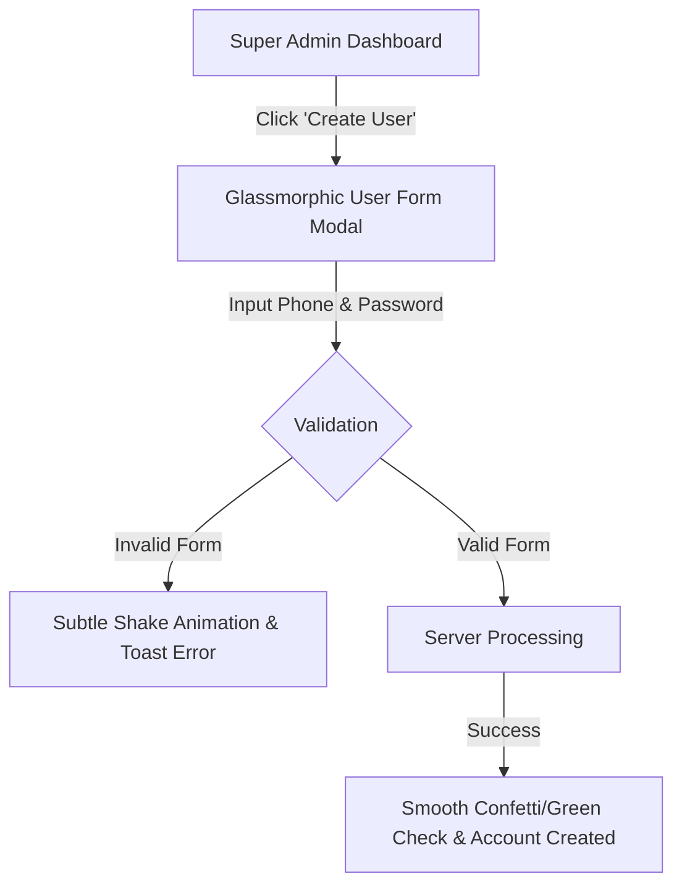
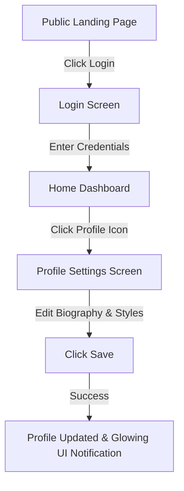
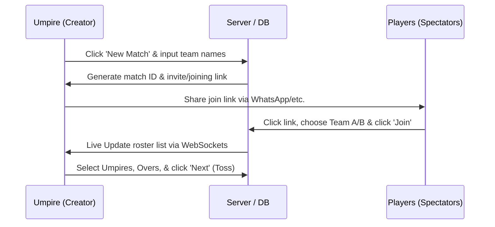
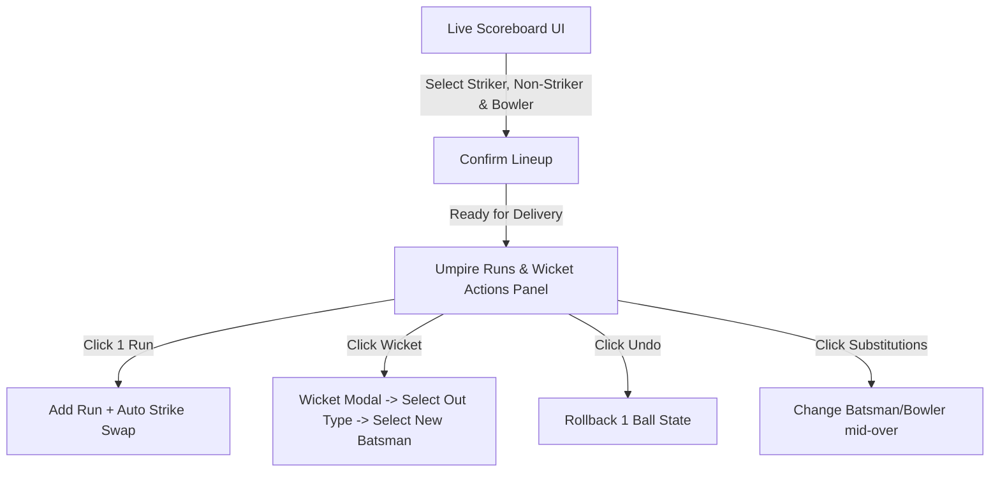
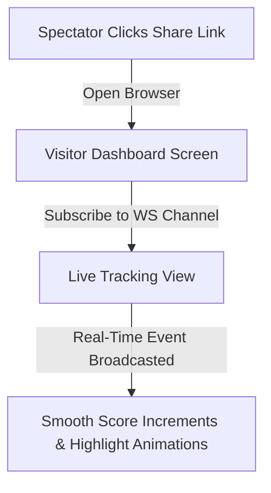

# BatNBall User Flows & Experience Blueprint

This document maps out the detailed User Experience (UX) journeys, screen layouts, interactions, and micro-animations for every action in the **BatNBall** platform.

---

## 1. Authentication & Profile Journey

### 1.1. Super Admin: Account Registration Flow

- **Step 1**: The Super Admin logs in and navigates to the Admin Panel.
- **Step 2**: Clicks the **Create User** button. A glassmorphic modal slides in from the right.
- **Step 3**: Enters the user's phone number and a temporary password.
- **Step 4**: Clicks **Submit**.
- **Step 5**: The system validates fields, registers the user, and presents a green success toast with a slide-out animation. A blank player profile is automatically linked to the user.

### 1.2. User: Login & Profile Update Flow

- **Step 1**: The user lands on the BatNBall home page.
- **Step 2**: Clicks **Login**, enters their Phone Number and Password.
- **Step 3**: Upon success, a loading spinner fades out, transitioning to the dynamic user Dashboard.
- **Step 4**: The user clicks their profile avatar (top-right corner).
- **Step 5**: Edits their biographical details (First Name, Last Name, Batting Style, Bowling Style, Player Roles) and uploads an avatar.
- **Step 6**: Clicks **Save Changes**. A glowing green toast confirms the update, and the updated details are immediately cached and displayed.

---

## 2. Match Setup & Rosters Flow

### 2.1. Match Creation (Phase 1: Team Initialization)
- **Action**: User clicks the floating action button **+ New Match**.
- **UI Transition**: A fresh setup screen opens with a smooth fade-in.
- **Inputs**: Input fields for Team A Name and Team B Name.
- **Click**: User clicks **Next**.

### 2.2. Match Setup (Phase 2: Roster & Parameters)
- **UI Screen**: Split-pane roster page.
- **Shared Invitation**:
  - A prominent **Share Link** button is displayed. Clicking it copies the match URL to the clipboard and triggers a native share sheet (e.g. WhatsApp, Messenger).
  - Other users click the link, landing on a clean join screen. They select **Team A** or **Team B**, enter/select their player name, and click **Join Match**.
  - **Live Tracking**: As players join via the link, their profiles instantly slide into the team roster lists on the Creator's screen with a fade-in animation, powered by WebSocket updates.
- **Manual Additions**: The creator can search for existing players in the database and click **Add** to place them on either team.
- **Configuration**:
  - The creator assigns Captains and Wicket-keepers.
  - Inputs the **Number of Overs**.
  - Selects up to **3 additional Umpires** (the creator is Umpire #1 by default).
- **Click**: Creator clicks **Next**.

### 2.3. Toss Screen (Phase 3)
- **UI Screen**: Dark, sports-themed coin-flip interface.
- **Inputs**:
  - Selector for **Toss Winner** (Team A or Team B).
  - Selector for **Decision** (Bat or Field).
- **Click**: Creator clicks **Start Match**. A stadium cheering sound effect plays briefly, and the interface transitions to the Live Scoreboard.

---

## 3. Live Scoring & Umpire Flow

The Live Scoring interface is the core engine of the application. It is designed to minimize cognitive load on the umpire during active play.

### 3.1. Strike and Ball Actions Flow
- **Initialization**: On match start, a modal prompts the umpire to select the **Striker**, **Non-Striker**, and **Bowler**. Clicks **Confirm**.
- **Scoring Buttons**: Large, thumb-friendly buttons for runs: `0`, `1`, `2`, `3`, `4`, `6`, and `Extras`, `Wicket`.
- **UX Automations**:
  - **Single Run (1)**: The umpire clicks `1`.
    - **Result**: The team total increments by 1. The striker's runs and balls faced increment. The striker and non-striker positions automatically slide-swap on the screen (CSS transition).
  - **Boundary (4 or 6)**: The umpire clicks `4` or `6`.
    - **Result**: The runs are added, and a subtle visual highlight animation triggers on the striker's score display. No strike rotation occurs.
  - **Legal Delivery Check**: Each legal delivery increments the ball count in the over (e.g., from `0.1` to `0.2`).
  - **Over Transition**: When the 6th legal delivery is logged:
    - **Result**: The UI swaps the striker and non-striker positions automatically. A prompt slides up: **"Over Complete. Choose Bowler for Over N"**. The umpire selects a bowler, confirms, and the match resumes.

### 3.2. Wicket Event Flow
- **Action**: The umpire clicks the **Wicket** button.
- **UI Transition**: A clean modal sheet slides up from the bottom of the screen.
- **Inputs**:
  - **Dismissal Type**: Dropdown (`Bowled`, `Caught`, `LBW`, `Run Out`, `Stumped`, etc.).
  - **Fielder involved**: (Required for Caught, Run Out, Stumped) Search-and-select dropdown showing the opposing team's roster.
  - **Dismissed Batsman**: (For Run Out) Checkbox to choose whether the Striker or Non-Striker was run out.
- **Click**: Umpire clicks **Confirm Dismissal**.
- **UI Transition**: The dismissed batsman is greyed out. A selection grid containing the remaining batsmen in the batting team roster appears. Clicking a batsman places them on the crease at the correct striker/non-striker spot.

### 3.3. Correcting Mistakes (Undo & Substitution)
- **Undo Event**: The umpire misclicks and wants to undo. Clicks the **Undo** button.
  - **Result**: The system pops the last event from the 5-ball undo stack. The UI values animate back to the state of the previous delivery.
- **Mid-Over Substitution Event**: Umpire realizes they set the wrong bowler or a batsman retired hurt.
  - **Action**: Clicks on the batsman or bowler name on the scorecard.
  - **UI Transition**: An editing dropdown appears. The umpire selects a different player from the active roster.
  - **Result**: The system updates the live scorecard. If balls were already logged under the wrong player, the database re-links those specific deliveries to the corrected player profile and updates the statistics.

---

## 4. Spectator & Visitor Flow

- **Step 1**: A spectator clicks the share link on their phone/desktop.
- **Step 2**: The app opens in read-only mode (no registration/login required).
- **Step 3**: The client establishes a WebSocket connection subscribing to the match channel.
- **Step 4**: The spectator views the live dashboard:
  - Main team score, current overs, run rate, required runs.
  - Current partnership details (runs scored, balls faced).
  - Last over summary (e.g., `1 • 4 Wd 6 W`).
  - Full interactive scorecard tab.
- **Step 5**: When the umpire logs a ball, the spectator's UI updates instantly with subtle color flashes (e.g., green flash for runs, red flash for wicket) to draw attention to changes without requiring page reloads.

---

## 5. Analytics & Leaderboards Journey

### 5.1. Searching & Viewing Player Stats
- **Step 1**: The user types a name in the global search bar at the top of the app.
- **Step 2**: Autocomplete displays matching profiles. User clicks a profile.
- **Step 3**: The Player Profile page loads:
  - Left Column: Biography, batting/bowling styles, team associations.
  - Right Column: Career stats grid (Matches, runs, average, wickets, best figures).
  - Bottom Panels: Rich visualizations (e.g. Chart.js / Recharts line graph showing runs scored over the last 10 matches, and a radar chart comparing batting control vs pace/spin).

### 5.2. Cap Leaders Lookup
- **Step 1**: User navigates to the **Leaderboard** tab in the main sidebar.
- **Step 2**: Three visual card stacks are displayed:
  - **Orange Cap** card (ranks top 5 run-scorers, topped by a glowing orange cap icon).
  - **Purple Cap** card (ranks top 5 wicket-takers, topped by a glowing purple cap icon).
  - **Chase Master** card (ranks top 5 chase batsmen with high winning percentages).
- **Step 3**: Hovering over or clicking a leader profile opens a quick-preview tooltip displaying their stats.
